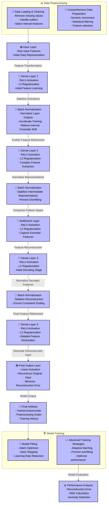

```mermaid
flowchart TD
    %% Preprocessing Subgraph
    subgraph Preprocessing ["📊 Data Preprocessing"]
        L["🧹 Data Loading & Cleaning
        - Remove missing values
        - Handle outliers
        - Select relevant features"]
        descL["📏 Comprehensive Data Preparation
        - Numeric conversion
        - Statistical filtering
        - Feature selection"]
    end

    %% Model Architecture Flowchart
    L --> A["📥 Input Layer
    - Raw Input Features
    - Initial Data Representation"]
  
    A -->|Feature Transformation| B["🔢 Dense Layer 1
    - ReLU Activation
    - L2 Regularization
    - Initial Feature Learning"]
  
    B -->|Stabilize Activations| C["🔄 Batch Normalization
    - Normalize Layer Outputs
    - Accelerate Training
    - Reduce Internal Covariate Shift"]
  
    C -->|Further Feature Refinement| D["🧩 Dense Layer 2
    - ReLU Activation
    - L2 Regularization
    - Complex Feature Extraction"]
  
    D -->|Normalize Representations| E["🔄 Batch Normalization
    - Stabilize Intermediate Representations
    - Prevent Overfitting"]
  
    E -->|Compress Feature Space| F["🔬 Bottleneck Layer
    - ReLU Activation
    - L2 Regularization
    - Capture Essential Features"]
  
    F -->|Feature Reconstruction| G["🔢 Dense Layer 3
    - ReLU Activation
    - L2 Regularization
    - Initial Decoding Stage"]
  
    G -->|Normalize Decoded Features| H["🔄 Batch Normalization
    - Stabilize Reconstruction
    - Ensure Consistent Scaling"]
  
    H -->|Final Feature Refinement| I["🧩 Dense Layer 4
    - ReLU Activation
    - L2 Regularization
    - Detailed Feature Restoration"]
  
    I -->|Generate Reconstructed Input| J["📤 Final Output Layer
    - Linear Activation
    - Reconstruct Original Input
    - Minimize Reconstruction Error"]
  
    %% Training Subgraph
    subgraph Training ["🏋️ Model Training"]
        M["🚀 Model Fitting
        - Adam Optimizer
        - Early Stopping
        - Learning Rate Reduction"]
        descM["📈 Advanced Training Strategies
        - Adaptive learning
        - Prevent overfitting
        - Optimize performance"]
    end
  
    J -->|Model Output| K["💾 Final Artifacts
    - Trained Autoencoder
    - Preprocessing Scaler
    - Training History"]
  
    K --> M
    descM -->|Model Evaluation| N["📊 Performance Analysis
    - Reconstruction Error
    - MSE Calculation
    - Anomaly Detection"]

    %% Styling
    classDef default fill:#BBF,stroke:#333,stroke-width:2px,color:#000;
    class L,A,B,C,D,E,F,G,H,I,J,K,N default;
```
