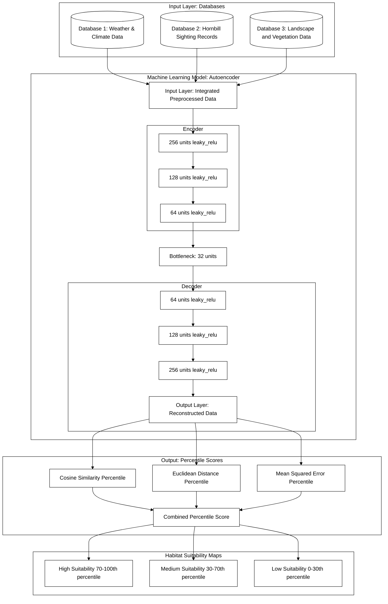

```mermaid
%%{init: {'theme': 'base', 'themeVariables': { 'primaryColor': '#ffffff', 'primaryTextColor': '#000000', 'primaryBorderColor': '#000000', 'lineColor': '#000000', 'secondaryColor': '#ffffff', 'tertiaryColor': '#ffffff', 'mainBkg': '#ffffff', 'nodeBorder': '#000000', 'clusterBkg': '#ffffff', 'clusterBorder': '#000000', 'titleColor': '#000000', 'edgeLabelBackground': '#ffffff', 'background': '#ffffff' }}}%%
flowchart TD
    subgraph InputLayer["Input Layer: Databases"]
        A1[(Database 1: Weather & Climate Data)]
        A2[(Database 2: Hornbill Sighting Records)]
        A3[(Database 3: Landscape and Vegetation Data)]
    end

    subgraph MLModel["Machine Learning Model: Autoencoder"]
        B1[Input Layer: Integrated Preprocessed Data]
      
        subgraph Encoder
            B2_1[256 units leaky_relu]
            B2_2[128 units leaky_relu]
            B2_3[64 units leaky_relu]
        end

        B2_4[Bottleneck: 32 units]
      
        subgraph Decoder
            B3_1[64 units leaky_relu]
            B3_2[128 units leaky_relu]
            B3_3[256 units leaky_relu]
            B3_4[Output Layer: Reconstructed Data]
        end
    end

    subgraph OutputLayer["Output: Percentile Scores"]
        C1[Cosine Similarity Percentile]
        C2[Euclidean Distance Percentile]
        C3[Mean Squared Error Percentile]
        C4[Combined Percentile Score]
    end

    subgraph HabitatSuitability["Habitat Suitability Maps"]
        D1[High Suitability 70-100th percentile]
        D2[Medium Suitability 30-70th percentile]
        D3[Low Suitability 0-30th percentile]
    end

    A1 --> B1
    A2 --> B1
    A3 --> B1
  
    B1 --> B2_1
    B2_1 --> B2_2
    B2_2 --> B2_3
    B2_3 --> B2_4
  
    B2_4 --> B3_1
    B3_1 --> B3_2
    B3_2 --> B3_3
    B3_3 --> B3_4
  
    B3_4 --> C1
    B3_4 --> C2
    B3_4 --> C3
  
    C1 --> C4
    C2 --> C4
    C3 --> C4
  
    C4 --> D1
    C4 --> D2
    C4 --> D3
```
